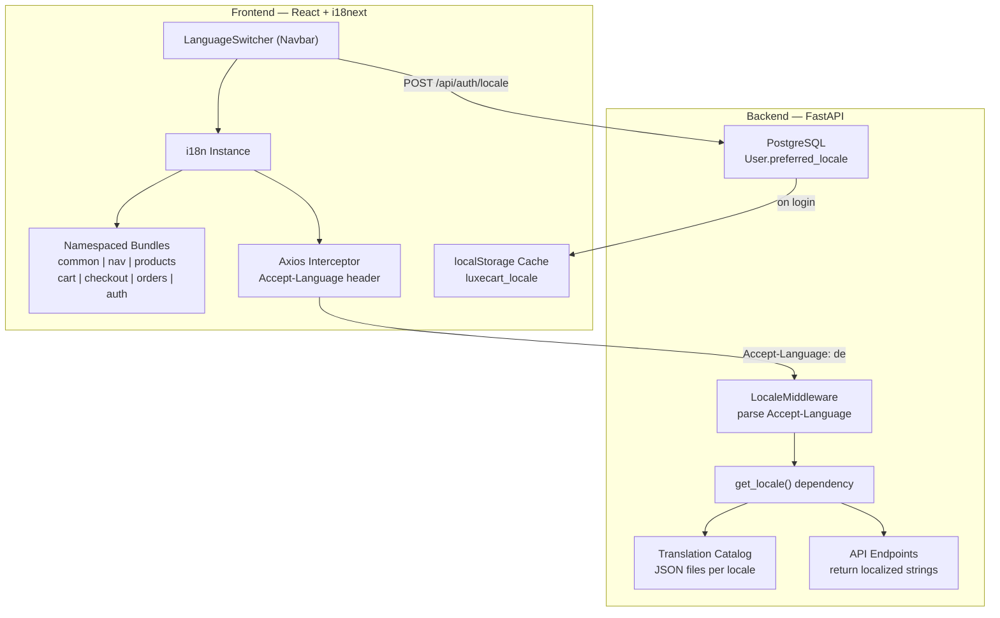

# Hybrid Multi-Language (i18n) System for LuxeCart

Implement an enterprise-grade, hybrid localization system that spans both the React frontend and FastAPI backend. The system supports **English (en)**, **German (de)**, and **Telugu (te)** with clean separation of translation logic from business logic.

## Architecture Overview



---

## User Review Required

> [!IMPORTANT]
> **Language Selection**: The plan includes **English (en)**, **German (de)**, and **Telugu (te)**. Confirm if these are the correct target languages or if you'd like different ones.

> [!IMPORTANT]
> **JSX remains `.jsx`**: Your project currently uses `.jsx` files (not `.tsx`). This plan keeps everything as JSX and does **not** convert the project to TypeScript. Type safety for translation keys will be addressed through a `translationKeys.js` constants file to prevent typos. If you want a full `.tsx` conversion, let me know.

> [!WARNING]
> **Database Migration**: Adding `preferred_locale` to the `User` table requires an Alembic migration against your Neon PostgreSQL database. This is safe (nullable column with default) but worth noting.

---

## Proposed Changes

### Component 1: Backend — Translation Catalog & Locale Infrastructure

Summary: Create the server-side localization engine — translation JSON files, middleware, dependency injection, and the translation helper.

---

#### [NEW] [app/i18n/](file:///c:/Users/Harsha.Vardhan/OneDrive%20-%20Tricon%20Infotech%20Pvt.%20Ltd/Desktop/fastapi-project/app/i18n/)

New directory containing the entire backend i18n subsystem:

```
app/i18n/
├── __init__.py            # Exports public API
├── middleware.py           # LocaleMiddleware (Starlette middleware)
├── dependencies.py         # get_locale() FastAPI dependency
├── translator.py           # Translator class (loads & queries catalogs)
└── locales/
    ├── en.json             # English translation catalog
    ├── de.json             # German translation catalog
    └── te.json             # Telugu translation catalog
```

**Translation Catalog Structure** (`en.json` example):
```json
{
  "order_status": {
    "pending": "Pending",
    "confirmed": "Confirmed",
    "shipped": "Shipped",
    "delivered": "Delivered",
    "cancelled": "Cancelled"
  },
  "messages": {
    "payment_success": "Payment processed successfully!",
    "payment_failed": "Payment could not be processed.",
    "order_placed": "Your order has been placed successfully!",
    "cart_empty": "Your cart is empty.",
    "email_registered": "This email is already registered.",
    "invalid_credentials": "Invalid email or password.",
    "welcome": "Welcome to LuxeCart API!"
  },
  "labels": {
    "order": "Order",
    "total": "Total",
    "shipping_address": "Shipping Address",
    "quantity": "Quantity",
    "price": "Price"
  }
}
```

**`middleware.py`** — Starlette middleware that:
1. Reads `Accept-Language` header (parses quality values like `de-DE,de;q=0.9,en;q=0.8`)
2. Extracts the best-match locale from supported set `{en, de, te}`
3. Stores locale in `request.state.locale`

**`dependencies.py`** — `get_locale(request: Request) -> str` FastAPI dependency that returns the resolved locale from `request.state`.

**`translator.py`** — `Translator` singleton class:
- Loads all JSON catalogs at startup
- `t(locale, key)` → returns translated string (dot-notation: `"order_status.pending"`)
- Falls back to English if key missing in target locale

---

### Component 2: Backend — User Model & API Changes

Summary: Add locale persistence to users, wire middleware into the app, and localize API responses.

---

#### [MODIFY] [user.py](file:///c:/Users/Harsha.Vardhan/OneDrive%20-%20Tricon%20Infotech%20Pvt.%20Ltd/Desktop/fastapi-project/app/models/user.py)

Add `preferred_locale` column:
```diff
+    preferred_locale = Column(String(10), default="en", nullable=False)
```

#### [MODIFY] [schemas.py](file:///c:/Users/Harsha.Vardhan/OneDrive%20-%20Tricon%20Infotech%20Pvt.%20Ltd/Desktop/fastapi-project/app/schemas/schemas.py)

- Add `preferred_locale` to `UserResponse` and `Token` schemas
- Add `LocaleUpdate` schema: `{ locale: str }`

#### [MODIFY] [main.py](file:///c:/Users/Harsha.Vardhan/OneDrive%20-%20Tricon%20Infotech%20Pvt.%20Ltd/Desktop/fastapi-project/app/main.py)

- Import and register `LocaleMiddleware`
- Add `Accept-Language` to CORS `allow_headers`

#### [MODIFY] [auth.py](file:///c:/Users/Harsha.Vardhan/OneDrive%20-%20Tricon%20Infotech%20Pvt.%20Ltd/Desktop/fastapi-project/app/routes/auth.py)

- Add `PUT /api/auth/locale` endpoint to update `User.preferred_locale`
- Include `preferred_locale` in login/register Token response

#### [MODIFY] [orders.py](file:///c:/Users/Harsha.Vardhan/OneDrive%20-%20Tricon%20Infotech%20Pvt.%20Ltd/Desktop/fastapi-project/app/routes/orders.py)

- Use `get_locale` dependency to localize `order.status` in responses
- Localize error message for empty cart

#### [NEW] [generate_migration.py](file:///c:/Users/Harsha.Vardhan/OneDrive%20-%20Tricon%20Infotech%20Pvt.%20Ltd/Desktop/fastapi-project/app/i18n/generate_migration.py)

Script/instructions to run `alembic revision --autogenerate -m "add preferred_locale to users"` and `alembic upgrade head`.

---

### Component 3: Frontend — i18next Setup & Translation Bundles

Summary: Install and configure i18next with namespaced JSON translation files and Axios interceptor.

---

#### Install Dependencies

```bash
npm install i18next react-i18next i18next-browser-languagedetector
```

#### [NEW] [frontend/src/i18n/](file:///c:/Users/Harsha.Vardhan/OneDrive%20-%20Tricon%20Infotech%20Pvt.%20Ltd/Desktop/fastapi-project/frontend/src/i18n/)

```
frontend/src/i18n/
├── index.js                # i18n instance configuration
├── translationKeys.js      # Constants for all translation keys (type-safety)
└── locales/
    ├── en/
    │   ├── common.json     # Buttons, labels, shared strings
    │   ├── nav.json        # Navbar & sidebar strings
    │   ├── products.json   # Product listing & detail strings
    │   ├── cart.json       # Cart page strings
    │   ├── checkout.json   # Checkout flow strings
    │   ├── orders.json     # Order history strings
    │   └── auth.json       # Login/Register strings
    ├── de/
    │   └── (same structure)
    └── te/
        └── (same structure)
```

**`index.js`** — i18n instance:
```js
import i18n from 'i18next';
import { initReactI18next } from 'react-i18next';
import LanguageDetector from 'i18next-browser-languagedetector';

// Import all namespace bundles
import enCommon from './locales/en/common.json';
import enNav from './locales/en/nav.json';
// ... all namespaces × all locales

i18n
  .use(LanguageDetector)
  .use(initReactI18next)
  .init({
    resources: { en: { common: enCommon, nav: enNav, ... }, de: { ... }, te: { ... } },
    defaultNS: 'common',
    fallbackLng: 'en',
    supportedLngs: ['en', 'de', 'te'],
    interpolation: { escapeValue: false },
    detection: {
      order: ['localStorage', 'navigator'],
      lookupLocalStorage: 'luxecart_locale',
      caches: ['localStorage'],
    },
  });
```

**`translationKeys.js`** — Centralized key constants to prevent typos:
```js
export const T = {
  NAV: {
    HOME: 'nav:home',
    PRODUCTS: 'nav:products',
    ORDERS: 'nav:orders',
    SIGN_IN: 'nav:signIn',
    SIGN_OUT: 'nav:signOut',
    MY_ORDERS: 'nav:myOrders',
    CART: 'nav:cart',
  },
  COMMON: {
    ADD_TO_CART: 'common:addToCart',
    LOADING: 'common:loading',
    // ...
  },
  // ...per namespace
};
```

#### [MODIFY] [api.js](file:///c:/Users/Harsha.Vardhan/OneDrive%20-%20Tricon%20Infotech%20Pvt.%20Ltd/Desktop/fastapi-project/frontend/src/api.js)

Add `Accept-Language` interceptor and `updateLocale` API function:
```diff
+ import i18n from './i18n';
+
  API.interceptors.request.use((config) => {
    const token = localStorage.getItem('luxecart_token');
    if (token) {
      config.headers.Authorization = `Bearer ${token}`;
    }
+   config.headers['Accept-Language'] = i18n.language || 'en';
    return config;
  });

+ // ---- Locale ----
+ export const updateLocale = (locale) => API.put('/auth/locale', { locale });
```

#### [MODIFY] [main.jsx](file:///c:/Users/Harsha.Vardhan/OneDrive%20-%20Tricon%20Infotech%20Pvt.%20Ltd/Desktop/fastapi-project/frontend/src/main.jsx)

Import `./i18n` to initialize i18next before React renders:
```diff
+ import './i18n';
  import './index.css'
```

---

### Component 4: Frontend — LanguageSwitcher Component

Summary: A premium animated dropdown in the Navbar for switching languages, with flag icons and smooth transitions.

---

#### [NEW] [LanguageSwitcher.jsx](file:///c:/Users/Harsha.Vardhan/OneDrive%20-%20Tricon%20Infotech%20Pvt.%20Ltd/Desktop/fastapi-project/frontend/src/components/LanguageSwitcher.jsx)

Animated globe-icon dropdown with:
- 🌐 Globe icon button
- Dropdown with flag emojis + language names: 🇺🇸 English, 🇩🇪 Deutsch, 🇮🇳 తెలుగు
- Active language indicator (purple highlight)
- On selection: calls `i18n.changeLanguage()`, saves to `localStorage`, and calls `updateLocale()` API if user is authenticated
- Glassmorphism styling consistent with existing design system

#### [MODIFY] [Navbar.jsx](file:///c:/Users/Harsha.Vardhan/OneDrive%20-%20Tricon%20Infotech%20Pvt.%20Ltd/Desktop/fastapi-project/frontend/src/components/Navbar.jsx)

- Import `LanguageSwitcher`
- Import `useTranslation` from `react-i18next`
- Replace hardcoded strings (`'Home'`, `'Products'`, `'Orders'`, `'Sign In'`, `'Sign Out'`, `'My Orders'`, `'Cart'`) with `t()` calls using the `nav` namespace
- Place `<LanguageSwitcher />` next to cart icon in both desktop and mobile views

---

### Component 5: Frontend — Localize All Pages & Components

Summary: Replace every hardcoded user-facing string across pages and components with `useTranslation()` calls.

---

#### [MODIFY] [HomePage.jsx](file:///c:/Users/Harsha.Vardhan/OneDrive%20-%20Tricon%20Infotech%20Pvt.%20Ltd/Desktop/fastapi-project/frontend/src/pages/HomePage.jsx)
- Hero title, subtitle, CTA buttons → `common` namespace

#### [MODIFY] [ProductsPage.jsx](file:///c:/Users/Harsha.Vardhan/OneDrive%20-%20Tricon%20Infotech%20Pvt.%20Ltd/Desktop/fastapi-project/frontend/src/pages/ProductsPage.jsx)
- Filter labels, search placeholder, sort options → `products` namespace

#### [MODIFY] [ProductDetailPage.jsx](file:///c:/Users/Harsha.Vardhan/OneDrive%20-%20Tricon%20Infotech%20Pvt.%20Ltd/Desktop/fastapi-project/frontend/src/pages/ProductDetailPage.jsx)
- Size selector, add-to-cart button, reviews, description labels → `products` namespace

#### [MODIFY] [CartPage.jsx](file:///c:/Users/Harsha.Vardhan/OneDrive%20-%20Tricon%20Infotech%20Pvt.%20Ltd/Desktop/fastapi-project/frontend/src/pages/CartPage.jsx)
- Cart title, empty cart message, quantity labels, totals → `cart` namespace

#### [MODIFY] [CheckoutPage.jsx](file:///c:/Users/Harsha.Vardhan/OneDrive%20-%20Tricon%20Infotech%20Pvt.%20Ltd/Desktop/fastapi-project/frontend/src/pages/CheckoutPage.jsx)
- Form labels, place order button, order summary → `checkout` namespace

#### [MODIFY] [OrdersPage.jsx](file:///c:/Users/Harsha.Vardhan/OneDrive%20-%20Tricon%20Infotech%20Pvt.%20Ltd/Desktop/fastapi-project/frontend/src/pages/OrdersPage.jsx)
- Order history title, status badges, date labels → `orders` namespace

#### [MODIFY] [LoginPage.jsx](file:///c:/Users/Harsha.Vardhan/OneDrive%20-%20Tricon%20Infotech%20Pvt.%20Ltd/Desktop/fastapi-project/frontend/src/pages/LoginPage.jsx)
- Form labels, buttons, toggle text → `auth` namespace

#### [MODIFY] [Footer.jsx](file:///c:/Users/Harsha.Vardhan/OneDrive%20-%20Tricon%20Infotech%20Pvt.%20Ltd/Desktop/fastapi-project/frontend/src/components/Footer.jsx)
- Footer text, links → `common` namespace

#### [MODIFY] [ProductCard.jsx](file:///c:/Users/Harsha.Vardhan/OneDrive%20-%20Tricon%20Infotech%20Pvt.%20Ltd/Desktop/fastapi-project/frontend/src/components/ProductCard.jsx)
- "Add to Cart" button, rating text → `products` namespace

---

### Component 6: Frontend — Layout Guards for Text Expansion

Summary: CSS additions to handle German/Telugu text being 30-50% longer than English.

---

#### [MODIFY] [index.css](file:///c:/Users/Harsha.Vardhan/OneDrive%20-%20Tricon%20Infotech%20Pvt.%20Ltd/Desktop/fastapi-project/frontend/src/index.css)

Add i18n-safe layout utilities:
```css
/* ============================================
   i18n — Text Expansion Guards
   ============================================ */
.btn-premium, .btn-outline {
  white-space: nowrap;
  min-width: max-content;
}

/* Fluid text containers */
[data-i18n-fluid] {
  word-break: break-word;
  overflow-wrap: break-word;
  hyphens: auto;
}

/* Nav links expand gracefully */
nav a {
  white-space: nowrap;
  flex-shrink: 0;
}
```

---

### Component 7: Persistence — Sync Locale on Login

Summary: Wire locale persistence: save to DB on change, restore from DB on login, cache in localStorage.

---

#### [MODIFY] [AuthContext.jsx](file:///c:/Users/Harsha.Vardhan/OneDrive%20-%20Tricon%20Infotech%20Pvt.%20Ltd/Desktop/fastapi-project/frontend/src/context/AuthContext.jsx)

- On `loginUser()`: read `user.preferred_locale` from API response → call `i18n.changeLanguage(locale)` → save to `localStorage`
- On `logout()`: keep current localStorage locale (don't reset)

---

## Open Questions

> [!IMPORTANT]
> **Alembic Setup**: Your project has `alembic` in `requirements.txt` but I don't see an `alembic/` directory. Would you like me to initialize Alembic (`alembic init`) as part of this implementation, or do you prefer to add the column manually via a SQL command on Neon?

---

## Verification Plan

### Automated Tests
1. **Backend**: Start FastAPI server and test:
   - `curl -H "Accept-Language: de" http://localhost:8000/api/orders` → confirm German status strings
   - `curl -H "Accept-Language: te" http://localhost:8000/` → confirm Telugu welcome message
   - `PUT /api/auth/locale` → confirm locale saved to User record
2. **Frontend**: `npm run dev` and verify:
   - LanguageSwitcher renders in Navbar
   - Switching to German updates all visible strings
   - Page refresh preserves language (localStorage)
   - Network tab shows `Accept-Language: de` header on API calls

### Browser Recording
- Record a full language switching flow (en → de → te → en) showing the Navbar, HomePage, and a product detail page updating in real-time.
